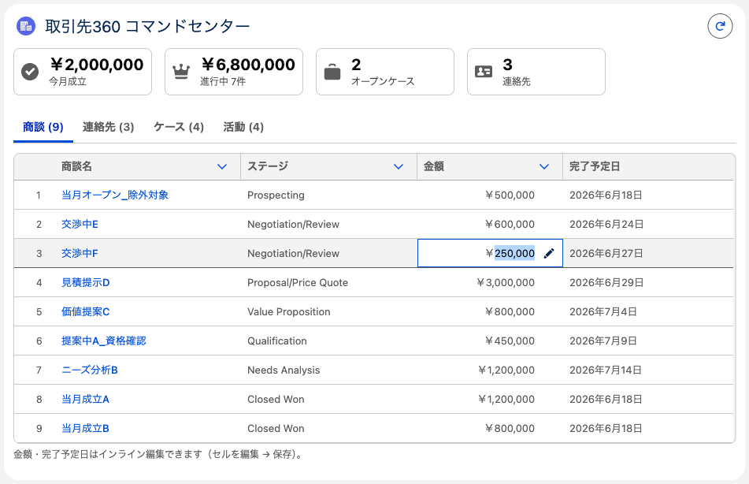
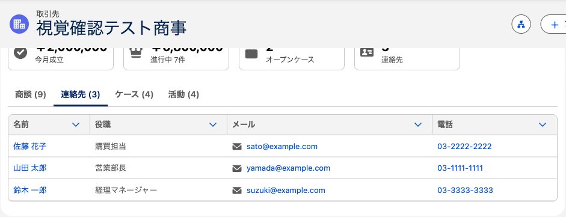
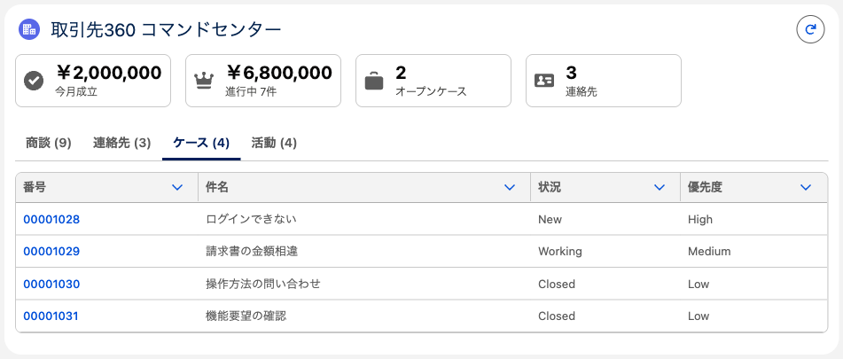
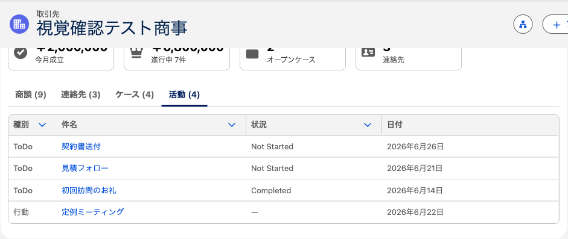

# 取引先360 コマンドセンター（Apex + LWC）

取引先（Account）のレコードページ上で、**KPI と 関連レコード（商談 / 連絡先 / ケース / 活動）を1か所に集約**し、
商談タブは**金額・完了予定日をインライン編集**できる「コマンドセンター」です。
1つの取引先について「いま何が起きているか」を、別画面に移らず把握・更新できます。

## 技術スタック / ポイント

- **親子コンポーネント構成**：親 `account360` ＋ 子 `kpiCard`（`@api` で KPI を受け取る再利用部品）
- **`@AuraEnabled` Apex**：`Account360Controller`（KPI 集計＋4種の関連レコード取得＋商談更新）
- **リアクティブ集約**：`@wire`（`cacheable=true`）を **5本**（KPI / 商談 / 連絡先 / ケース / 活動）並走
- **CRUD/FLS の担保**：読み取り `WITH USER_MODE`（集計 SOQL 含む）、書き込み `Database.update(.., AccessLevel.USER_MODE)`
- **KPI**：今月成立額 / 進行中商談（件数・額）/ オープンケース数 / 連絡先数（SOQL 集計関数）
- **タブ**：`lightning-tabset` ＋ `lightning-datatable` ×4。各行はレコードへのリンク（`type: url`）
- **活動タブ**：Task と Event（別オブジェクト）を1つの DTO に統合して表示
- **インライン編集**：商談タブの金額・完了予定日を編集 → 保存（`onsave` → Apex → Toast → `refreshApex`）。保存後は **KPI も再計算**
- **テスト**：Apex 5 ケース（カバレッジ 98%）／ LWC Jest 3 ケース

---

## ① KPI ＋ 商談タブ（インライン編集）

上部に KPI カード、その下にタブ。商談タブは金額・完了予定日を**セル編集 → 保存**でき、保存後は KPI も更新されます（下図は「交渉中F」の金額を編集中）。

## ② 連絡先タブ

名前（リンク）・役職・メール・電話。`type: email` / `type: phone` で表示。

## ③ ケースタブ

番号（リンク）・件名・状況・優先度。オープン件数は KPI にも反映。

## ④ 活動タブ（Task ＋ Event 統合）

ToDo（Task）と 行動（Event）という**別オブジェクトを1つのテーブルに統合**。種別・件名（リンク）・状況・日付。

---

## 設計・セキュリティのポイント

- **ユーザーモード実行で CRUD/FLS を担保**：読み取り `WITH USER_MODE`、書き込み `AccessLevel.USER_MODE`。集計（Aggregate SOQL）も `WITH USER_MODE`。
- **親子コンポーネント（コンポジション）**：KPI 1枚を子 `kpiCard`（`@api label / value / iconName`）に切り出し、親から `for:each` で展開。
- **5つの @wire を並走**：KPI と各リストを別々に取得。商談保存後は「商談」と「KPI」の wire だけ `refreshApex` で再取得し、依存する数値を整合。
- **異なるオブジェクトの統合**：活動は Task と Event を DTO（`ActivityRow`）にまとめて返す（`WhatId = 取引先`）。
- **インライン編集の保存**：datatable の `draftValues`（Id ＋ 編集項目）をそのまま Apex `List<Opportunity>` で受け、`USER_MODE` で一括更新。

## 配置

取引先レコードページ（FlexiPage）の main 領域に配置。**同じページに「商談カンバン」と同居**し、取引先の総合ダッシュボードになります（カンバン＝パイプライン操作、360＝集約・即編集）。

## CI/CD

この機能も GitHub Actions の CI/CD パイプラインの対象です（PR で検証＋各種チェック、`main` マージで Developer Edition へ自動デプロイ）。Apex 98% / LWC Jest 3 ケース。詳細は [README の CI/CD](../README.md#cicd) を参照。

---

> 補足：表示データは検証用 scratch org のテストデータ（連絡先 3 / ケース 4 / ToDo 3 / 行動 1）です。本番 Developer Edition には別途用意が必要。
> 360 は Sales（標準セールス）アプリのページ割り当てのため、**Sales アプリで取引先を開く**と表示されます。
