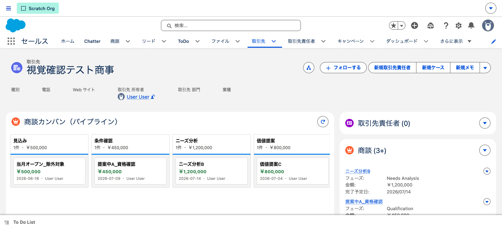
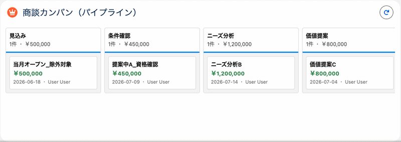

# 商談カンバン（パイプライン）ボード（Apex + LWC）

取引先（Account）のレコードページ上で、関連する**商談（Opportunity）をステージ別の列に並べ**、
**カードをドラッグ&ドロップしてステージを更新**できる、インタラクティブな営業パイプライン画面です。
列ごとの**金額合計はその場でライブ再計算**されます（VF の静的帳票では作れない、LWC ならではのリッチ UI）。

## 技術スタック / ポイント

- **Lightning Web Component**：`opportunityKanban`（HTML / JS / CSS / `.js-meta.xml`）
- **`@AuraEnabled` Apex**：`OpportunityKanbanController`（`getStages` / `getOpportunities` / `updateStage`）
- **データ連携**：読み取りは `@wire`（`cacheable=true`）、更新は imperative 呼び出し＋`refreshApex` で再取得
- **CRUD/FLS の担保**：読み取り SOQL は `WITH USER_MODE`、書き込みは `Database.update(rec, AccessLevel.USER_MODE)`（ユーザー権限を強制）
- **ドラッグ&ドロップ**：標準の HTML5 DnD（`dragstart` / `dragover` / `drop`）。更新後は Toast＋`refreshApex` で整合
- **ステージ列**：`OpportunityStage`（有効値）を `SortOrder` 順に取得し、org のステージ構成に追従。**見出しは日本語表示**（API 値＝英語は更新用にそのまま保持し、表示ラベルだけ日本語化）
- **配置もコード管理**：取引先レコードページ（FlexiPage）＋ Sales アプリのページ割り当て（`CustomApplication` の `actionOverrides`）まで**メタデータ化**し、デプロイだけで再現
- **テスト**：Apex 7 ケース（カバレッジ 98%）／ LWC Jest 5 ケース

---

## ① 取引先レコードページ上のカンバン

取引先詳細の上部に、その取引先の商談をステージ別カンバンで表示。列ヘッダーに**件数・金額合計**、カードに**商談名・金額・完了予定日・所有者**を表示します。

## ② ドラッグ&ドロップでステージ更新 → 合計がライブ再計算

カードを別の列へドラッグすると、`StageName` が更新され（`AccessLevel.USER_MODE`）、移動元・移動先の**金額合計が即座に再計算**されます。下の GIF は「価値提案」の商談（¥800,000）を「ニーズ分析」へ移し、**¥1,200,000 → ¥2,000,000** に変わる様子（実環境で操作・自動再生）。

---

## 設計・セキュリティのポイント

- **ユーザーモード実行で CRUD/FLS を担保**：Apex は既定でシステム権限のため、`WITH USER_MODE` / `AccessLevel.USER_MODE` で「ログインユーザーが見られる・編集できる範囲」に制限。違反時は例外。
- **ステージは org 構成に追従**：フェーズ名を直書きせず `OpportunityStage` から動的取得。`IsWon` / `IsClosed` で成立列（緑）・失注列（赤）を色分け。
- **表示と API 値の分離**：`StageInfo { apiName, label, isWon, isClosed }`。`apiName`（英語の `StageName` 値）で照合・更新し、`label`（日本語）で表示。→ 日本語化しても D&D 更新は壊れない。（本格的な多言語化は翻訳ワークベンチが定石）
- **エラー処理**：更新失敗は `AuraHandledException` で握り、LWC 側で Toast 表示。読み込み中はスピナー、商談 0 件は空メッセージ。

## 配置（宣言的設定もソース管理）

| メタデータ                             | 役割                                                           |
| -------------------------------------- | -------------------------------------------------------------- |
| `opportunityKanban.js-meta.xml`        | コンポーネントの公開（`isExposed` / `targets` / Account 限定） |
| `Account_Opportunity_Kanban.flexipage` | 取引先レコードページ本体（main にカンバン＋詳細）              |
| `standard__LightningSales.app`         | Sales アプリでの**ページ割り当て**（`actionOverrides`）        |

> GUI（Lightning アプリケーションビルダー）で行ったページ有効化も、`sf project retrieve` で `CustomApplication` として取り込み、**手動 UI 設定をなくして再現性を確保**しています（repo = source of truth）。

## CI/CD

この機能も GitHub Actions の CI/CD パイプラインの対象です（PR で検証＋各種チェック、`main` マージで Developer Edition へ自動デプロイ）。LWC 追加により **ESLint / Jest** が本領を発揮します（Apex 98% / LWC Jest 5 ケース）。詳細は [README の CI/CD](../README.md#cicd) を参照。

---

> 補足：表示データは検証用 scratch org のテストデータ（取引先「視覚確認テスト商事」＋各ステージの商談）です。本番 Developer Edition には商談を別途用意する必要があります。
> カンバンは Sales（標準セールス）アプリのページ割り当てのため、**Sales アプリで取引先を開く**と表示されます。
