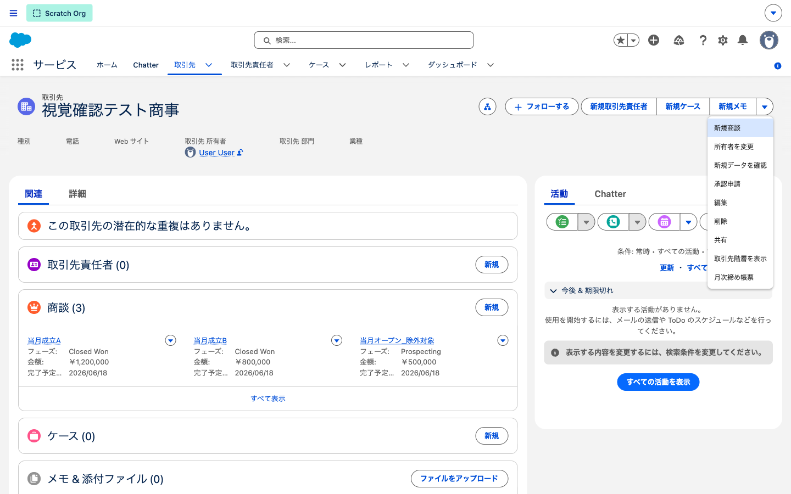
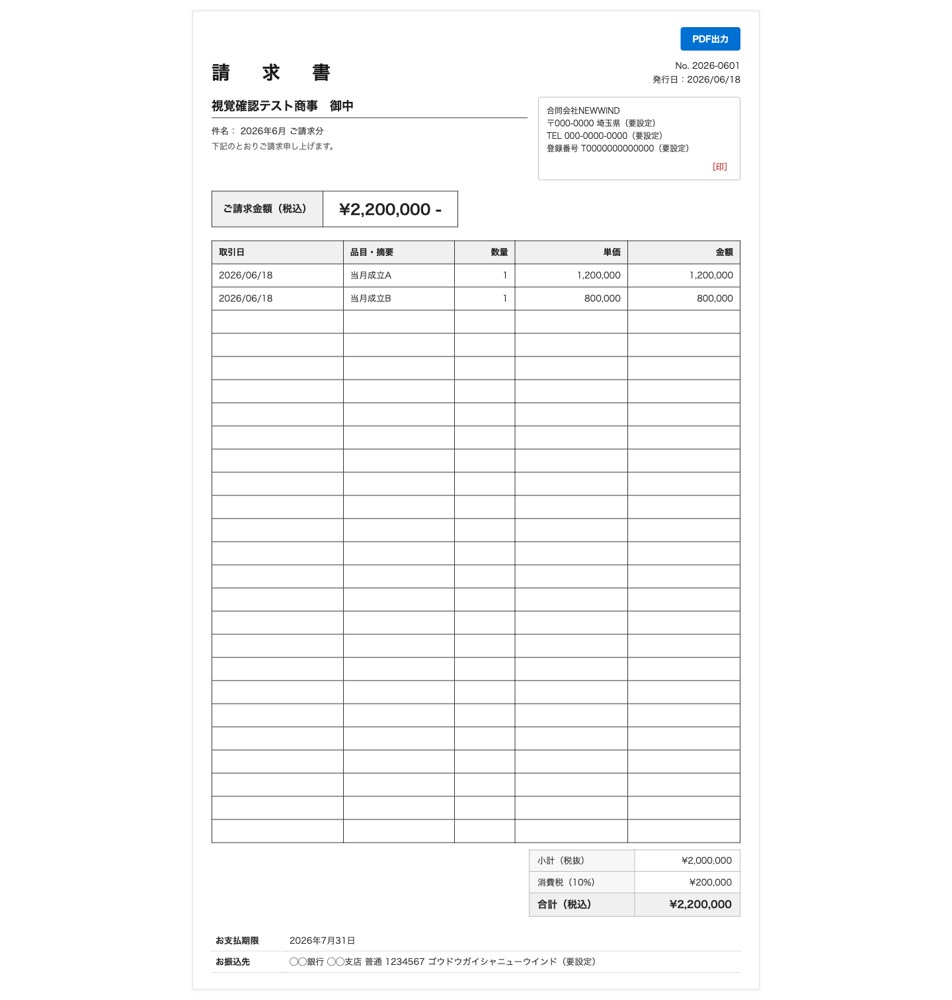
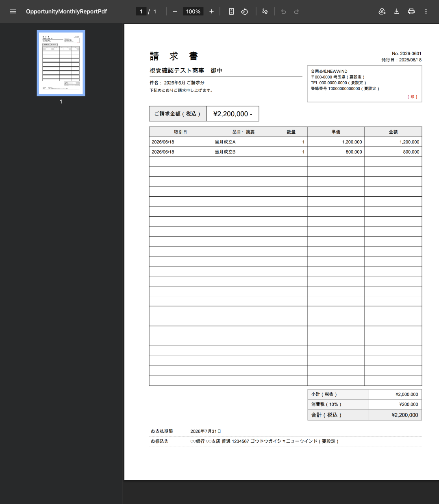

# 月次売上締め請求書（VisualForce + Apex）

取引先（Account）の詳細画面のボタンから、**当月に成立（Closed Won）した商談を集計**し、
**請求書（プレビュー & PDF）** を出力する機能です。

## 技術スタック / ポイント

- **VisualForce 2ページ**：プレビュー（HTML）と PDF（`renderAs="pdf"`・A4）
- **Apex 拡張コントローラ**：`standardController="Account"` + extension、SOQL は `WITH USER_MODE`（CRUD/FLS を尊重）
- **集計ロジック**：`IsWon = true AND CloseDate = THIS_MONTH`（フェーズ名直書きでなく成立フラグで判定）
- **請求書要素**：消費税10%計算、明細の固定行（A4で体裁を一定化）、インボイス制度の記載項目（登録番号・税率ごとの消費税 等）に準拠
- **起動**：取引先カスタムボタン（WebLink）→ ページレイアウトの Lightning アクションに配置（**レイアウトもコード管理**）
- **CI/CD**：GitHub Actions の対象（PR で検証＋Apex テスト＋各種チェック、`main` マージで Developer Edition へ自動デプロイ）

---

## ① 取引先画面のボタンから起動

取引先詳細のアクションメニューに **「月次締め帳票」** ボタンを配置。クリックで帳票プレビューを開きます。

## ② プレビュー画面（請求書レイアウト・HTML）

当月成立商談を請求書スタイルで表示。宛先・発行元・**ご請求金額（税込）**・明細・小計／消費税／合計・支払期限／振込先まで。右上「**PDF出力**」で PDF を新規タブに開きます。

## ③ PDF 出力（A4・`renderAs="pdf"`）

同じ内容を **A4 の請求書 PDF** として出力。明細は固定行で、件数が少なくても常に一定の体裁になります。

## CI/CD

この機能も GitHub Actions の CI/CD パイプラインの対象です（PR で検証＋各種チェック、`main` マージで Developer Edition へ自動デプロイ。Apex テスト カバレッジ 100%）。詳細は [README の CI/CD](../README.md#cicd) を参照。

---

> 補足：発行元名・住所・登録番号・振込先・請求書番号は学習用のダミー（コード内で `（要設定）`）。
> 表示データは検証用 scratch org のテストデータ（取引先「視覚確認テスト商事」＋当月成立商談2件）です。
